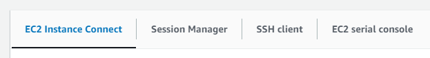
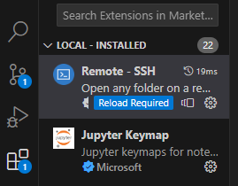
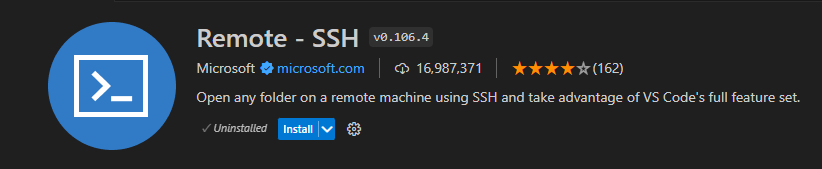
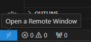
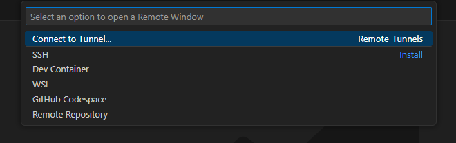
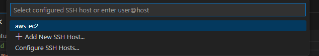
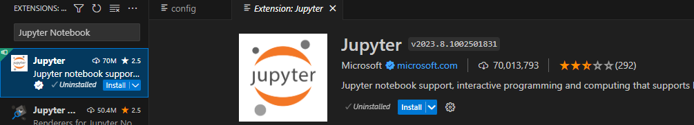

# Cloud computing
  
At Echospace we use Amazon Web Services for some projects. Some common use cases have been:

* store some datasets and make them accessible to many people
* use powerful virtual machines or clusters when individual researchers' laptops are not enough
* set up dashboards that can be continuously run and available for demo
  

## Set up credentials 

* Different types of credentials 
    - [ec2 key pairs](
https://docs.aws.amazon.com/AWSEC2/latest/UserGuide/ec2-key-pairs.html): you need those to connect to an ec2 instance
    - [access keys](https://docs.aws.amazon.com/IAM/latest/UserGuide/id_credentials_access-keys.html) (often stored in a `credentials.csv` or an `accessKeys.csv` file): those are used either through the [AWS Command Line Interface](https://aws.amazon.com/cli/) or other tools to programmatically use aws services
    - [console log-in](https://docs.aws.amazon.com/signin/latest/userguide/introduction-to-iam-user-sign-in-tutorial.html) (stored in a `credentials.csv` file): you can use it to start/stop some services and monitor your resources 
    - [configuration and credential files](https://docs.aws.amazon.com/cli/latest/userguide/cli-configure-files.html): those files have specific structure and are useful when storing different configurations
   
* Security of credentials
    - It is crucial to be very cautious when managing security credentials. A common danger is to commit credentials to github and make them public. There are credential hackers who regularly scan github for credentials and use them as soon as they become exposed. To avoid this problem, NEVER PUT CREDENTIALS DIRECTLY IN CODE (SCRIPTS OR NOTEBOOKS). Do not do this even temporarily, as you might forget to reverse the changes before you commit. It is best to store them in files and read the files from the code. Include the credential filename in your `.gitignore`.

 
## Getting Started Tutorials: Overview

* Recommended Starting Links
    * [ec2 instance set-up](https://frosted-hamster-458.notion.site/Set-up-env-ec2-faeceebfc16f45509d3f4c18c25f2c22) by @ldr426
    * [eScience Cloud 101](https://cloudmaven.github.io/documentation/aws_overview.html) tutorial 
    * [AWS Skill Center](https://aws.amazon.com/training/skills-centers/seattle-skills-center/)
          
### Short Tutorial on VSCode and Python with EC2
- Start EC2 Instance
    - (Note: This Assumes that you have created an EC2 Instance with "enough" RAM, have a permissions file, and have the ability to log into your AWS account and access the AWS Console)
    1) Search EC2 In the console search bar
    2) Click on Instances
    3) Turn on the instance you wish to connect to
        - Click on the instance’s ID and you should see the following:
            
            
        - Click on the Instance State dropdown menu
        - Click Start Instance
    4) You should now see a page with the following tab bar. Make sure you stay on this page. The most    important tabs here are EC2 Instance Connect and SSH Client.
            
        
- Install VSCode [Download Link](https://code.visualstudio.com/download) and open up a VSCode Window
- Install remote SSH on VSCode
    1) Search "Remote - SSH" in extensions
        
        
    2) Install it
        
        
- Setup Configuration File and Connect to EC2 Instance open_remote_window.png
    1) Go to the Bottom Left and Click the two carrot button
        
        
    2) You should now see the following window on the top of your VSCode window
        
        
    3) Click on SSH and then on Add New SSH Host
    4) Enter SSH Command as found in the SSH client session of the Connect page for your EC2 Instance
    5) It’ll then ask you what SSH configuration file to update. Choose any.
    6) It’ll then show you the SSH configuration file that you chose to update. Make sure that there is only 1 Host, 1 HostName, 1 User, and 1 Identity File.
    7) The most recent HostName should be correct and the Host can be any name you wish for it to be.
    8) Make sure that the User aligns with what is shown in the User name entry found in EC2 Instance Connect section in the Connect page for your EC2 instance
    9) Click again on the bottom left corner, click Connect to Host, and then click whichever Host you had previously configured.
        
        
        - You should now be connected access your EC2 instance via SSH.
- Setup EC2 Instance via VSCode Connection with Python, Git, and Github
    1) In the terminal, run `sudo yum install python`
    2) In the terminal, run `sudo yum install git`
    3) To log into your github account on the EC2 instance, follow steps 3 through 5 as shown in this guide [Amazon EC2 Beginners Guide](https://saturncloud.io/blog/how-to-set-up-git-on-amazon-cloud-ec2-a-beginners-guide/)
    4) Install the Jupyter Notebook extension via VSCode
        
        
    5) Insert the following Test Python Script `hello.py` anywhere in your EC2 Instance: [Gist hello.py Script](https://gist.github.com/mosbth/b274bd08aab0ed0f9521).
    6) Run the `hello.py` script with `python -u /path-to-hello-script/hello.py` in the terminal.

## Billing

It is important to learn to monitor AWS billing even as a new user.

* [Billing Page](https://us-east-1.console.aws.amazon.com/billing/home?region=us-west-2#/bills)
* [Pricing of EC2 instances](https://aws.amazon.com/ec2/pricing/on-demand/)
* [Pricing of S3 storage](https://aws.amazon.com/s3/pricing/) Note: while moving data into S3 is free, moving data out of S3 is expensive (it is called egress fee). Discuss with us if you plan to download large (greater than 100GB) datasets out of S3
* [Pricing calculator](https://calculator.aws/#/)
         
## Tagging Resources

Tagging resources is particularly useful to track usage and billing. Resources do not get tagged automatically by the user on AWS when services get started from the console.  One needs to add tags manually during set up or after the service gets started. Please, the following tags for your resources.

* Email
* Owner
* Project 
* Task 

## Moving resources between different providers/local-to-cloud
* [Rclone](https://rclone.org/): `rclone` is a nice tool to move files between different filesystem types using typical `unux`-like syntax

## Cloud Agnostic Tools   

* [terraform](https://www.terraform.io/): terraform allow scripting the cloud set up commands and works with different cloud providers
* [fsspec](https://filesystem-spec.readthedocs.io/en/latest/): Filesystem Spec is a Python tool to access local, remote and embedded file systems and bytes storage in a unified way 
* [Prefect AWS](https://prefecthq.github.io/prefect-aws/): Prefect is a general data workflow tool which allows integration with AWS, but can be set up with other providers.

## What people have used in the group?
* Hake ML Project (Caesar)
* EC2 Instances
    - Converting, Calibrating, Regridding, Mask Creation
    - Storing data for quicker use on EFS
    - Storing data for backup use on S3

## Advice to admins:
* Rotate keys (have a schedule)
* Ask each user to set up [multi-factor authentification](https://docs.aws.amazon.com/IAM/latest/UserGuide/id_credentials_mfa_enable.html)
  - they should install an app such as DUO on their phone
  - the admin should generate a QR code and the user should scan it to get security keys
* Check tags
* Check EC2 Volumes
* Check EFS and S3 Volumes
* [Global View](https://us-east-1.console.aws.amazon.com/ec2globalview/) of ec2 instances (we can look in all regions)
* [CloudTrail](https://us-west-2.console.aws.amazon.com/cloudtrail/home?region=us-west-2#/events?ReadOnly=false)
    - Check what role is needed for users to see cloud trail
    - Check all zones
* Limit the number of regions available by default ([settings](https://us-east-1.console.aws.amazon.com/billing/home?region=us-east-1#/account))
* Extra services from AWS to help with cost monitoring and fraud detection:
  - [Budgets](https://docs.aws.amazon.com/cost-management/latest/userguide/budgets-managing-costs.html)

  - [Amazon CloudWatch](https://docs.aws.amazon.com/AmazonCloudWatch/latest/monitoring/gs_monitor_estimated_charges_with_cloudwatch.html)

  - [AWS CloudTrail](https://docs.aws.amazon.com/awscloudtrail/latest/userguide/cloudtrail-user-guide.html)

  - [AWS Trusted Advisor](https://docs.aws.amazon.com/awssupport/latest/user/get-started-with-aws-trusted-advisor.html)

  - [AWS Cost Anomaly Detection](https://aws.amazon.com/aws-cost-management/aws-cost-anomaly-detection/)

## Extra
* When to use cloud? Decision Tree Diagram (Valentina)
 
