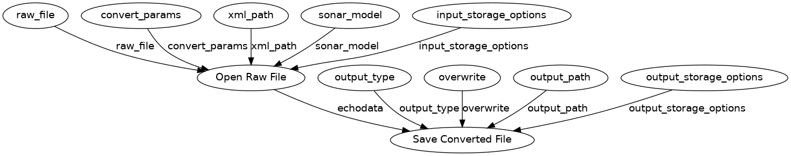
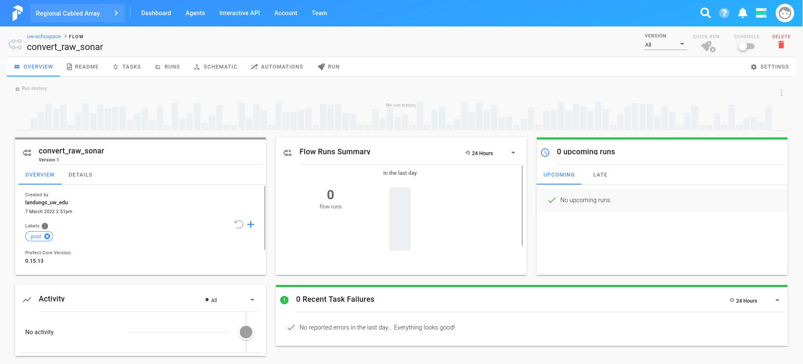
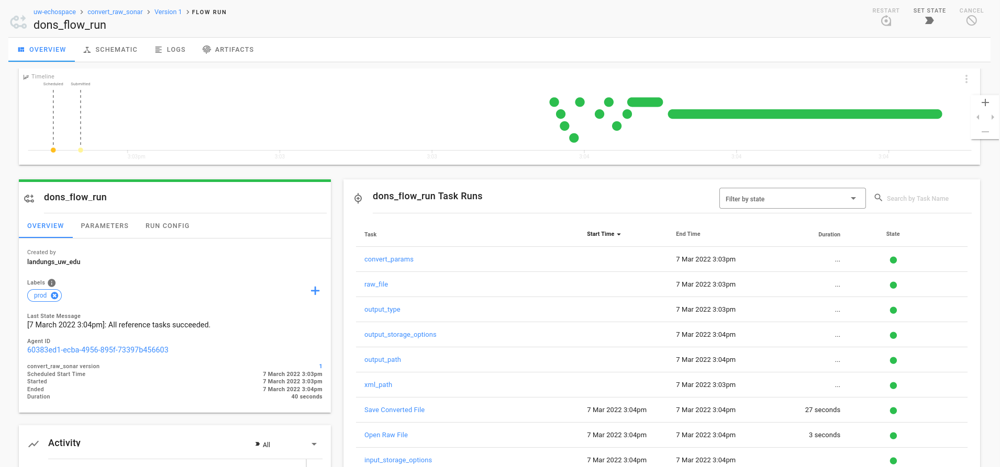

# Getting started with Prefect

Below are resources on getting started with Prefect and how to use Prefect as part of your data pipeline processing with Echopype.

## What is Prefect?

[Prefect](https://www.prefect.io/) is a start up company that has developed a new data workflow management system, designed for modern infrastructure and powered by the open-source Prefect Core workflow engine. Users organize Tasks into Flows, and Prefect takes care of the rest.

## Building Blocks

There are 2 main building block for prefect, which are `Flows` and `Tasks`.

### Tasks

A [`Task`](https://docs.prefect.io/core/concepts/tasks.html) is a step within a `Flow`. It is like a function where it takes inputs, execute an action, and can produce results.

### Flows

A [`Flow`](https://docs.prefect.io/core/concepts/flows.html) is a container for `Tasks`. It is a description of the entire data pipeline. Flows are [direct acyclic graphs](https://en.wikipedia.org/wiki/Directed_acyclic_graph).

## Other Concepts

There are many other concepts that are within Prefect. This getting started tutorial won't be covering all of that. You can learn more at the [prefect documentation website](https://docs.prefect.io/).

Another basic concepts that you should know to get started are `States`, `Signals`, `Logging`, `Parameters`.

### States

The `State` object is very important within Prefect. It is known as the "currency" of Prefect. It is a very information rich object that has three important characteristics: `type`, `message` and `result`.

For more information about states, [click here](https://docs.prefect.io/core/concepts/states.html).

#### type

There are three type of states: `Pending`, `Running`, and `Finished`. These states also have many children such as `Scheduled` and `Retrying` are both `Pending`; `Success` and `Failed` are both `Finished`. Both `Task` and `Flow` will emit these states, and one of the advantage of knowing the state of the task or flow is that Prefect provides a way for state handling, such as creating a notification when state changes or a specific state.

#### message

A state message is just a text that explains why that specific state was entered.

#### result

State result contains data associated with that state.

### Signals

State signal is a way for a final control over what state should be raised within a `Flow` or `Task` during a specific step. The main signals that you may use are `RETRY`, `SKIP`, `FAIL`, `SUCCESS`, and `PAUSE`.

### Logging

Prefect provides a nice way for logging events that are running within a task. You can retrieve this logging mechanism within a task by getting the logger from the `prefect.context`. **NOTE: Always access context as an attribute of the `prefect` module.**

### Parameters

Parameters are special tasks that can retrieve user input when a flow is run.

## Let's create a basic flow

Now that you have learned the basic building blocks and some other concepts, it's time to create your first flow.

1. Import packages needed

    ```python
    import prefect
    from prefect import task, Flow, Parameter
    from prefect.engine.signals import FAIL
    import echopype as ep
    from typing import Optional, Dict, Literal
    ```

2. Setup all the tasks we need

    ```python
    @task(
        name="Open Raw File",
        log_stdout=True # Log any print statement to logger
    )
    def open_raw(raw_file: str,
                sonar_model: str,
                xml_path: Optional[str] = None,
                convert_params: Optional[Dict[str, str]] = None,
                input_storage_options: dict = {}):
        """
        A task with similar signature to the echopype open_raw function.
        The result will be an echodata object
        """
        # Add logging
        logger = prefect.context.get('logger')
        logger.info(f"File conversion started for {raw_file}.")
        
        echodata = ep.open_raw(raw_file, sonar_model, xml_path,
                            convert_params, storage_options=input_storage_options)
        
        logger.info(f"File successfully converted. Currently stored as echodata object.")
        return echodata

    @task(
        name="Save Converted File",
        log_stdout=True # Log any print statement to logger
    )
    def save_data(echodata: ep.echodata.EchoData,
                output_path: str,
                output_type: Literal["zarr", "netcdf"] = "netcdf",
                overwrite: bool = False,
                output_storage_options: dict = {}):
        """
        A task with similar signature to the echodata to_zarr or to_netcdf function.
        The result will be the path string of the converted file
        """
        # Add logging
        logger = prefect.context.get('logger')
        logger.info(f"Echodata object saving started. Object will be serialized to {output_type}.")
        
        if output_type == "zarr":
            echodata.to_zarr(
                save_path = output_path,
                output_storage_options = output_storage_options
            )
        elif output_type == "netcdf":
            echodata.to_netcdf(
                save_path = output_path,
                output_storage_options = output_storage_options
            )
        else:
            raise FAIL(message=f"output type of {output_type} is not available.")
            
        converted_raw_path = echodata.converted_raw_path
            
        logger.info(f"Converted file is saved at {converted_raw_path}.")
        
        return converted_raw_path
    ```

3. Put all the tasks into a flow

    ```python
    with Flow("convert_raw_sonar") as flow:
        # Create parameters for open_raw task
        raw_file = Parameter("raw_file", required=True)
        sonar_model = Parameter("sonar_model", required=True)
        xml_path = Parameter("xml_path", default=None)
        convert_params = Parameter("convert_params", default=None)
        input_storage_options = Parameter("input_storage_options", default={})
        
        # Pass in parameters to open_raw task and capture the result
        echodata = open_raw(raw_file, sonar_model, xml_path,
                            convert_params, input_storage_options)
        
        # Create parameters for save_data task
        output_path = Parameter("output_path", required=True)
        output_type = Parameter("output_type", default="netcdf")
        overwrite = Parameter("overwrite", default=False)
        output_storage_options = Parameter("output_storage_options", default={})
        
        # Pass in parameters to save_data task and capture the result
        converted_raw_path = save_data(echodata, output_path, output_type, 
                                    overwrite, output_storage_options)
    ```

4. Visualize the flow as a [DAG](https://en.wikipedia.org/wiki/Directed_acyclic_graph) (Direct Acyclic Graph).

    ```python
    flow.visualize()
    ```

    

5. Running the flow locally

    ```python
    # Now run the flow locally
    # and capture the resulting flow state
    state = flow.run(parameters=dict(
        raw_file='s3://ncei-wcsd-archive/data/raw/Bell_M._Shimada/SH1707/EK60/Summer2017-D20170728-T181619.raw',
        sonar_model='EK60',
        input_storage_options={'anon': True},
        output_path='./hake-test.nc',
        output_type='netcdf',
        overwrite=True
    ))
    ```

6. Get result from `save_data` task

    ```python
    converted_file_path = state.result[converted_raw_path].result
    ```

7. Check the file with open_converted directly

    ```python
    echodata = ep.open_converted(converted_file_path)
    ```

## What's next

Okay, so we got an echopype conversion flow that can convert a raw file to a standardized netcdf file. How do we deploy to the cloud?

### The Prefect Hybrid Model

Prefect uses what's called a Hybrid Model for flow orchestration. Basically when "registering" a flow to a Prefect Cloud, we are sending metadata that is sufficient to reconstruct a code-less version of the workflow: details like the tasks it contains and their dependency structure; its schedule; information about its runtime environment; etc. At the end of the day, the code actually get's excuted within our own infrastructure!

For more detailed explanation straight from the CEO see his post on [medium](https://medium.com/the-prefect-blog/the-prefect-hybrid-model-1b70c7fd296).


#### Steps to deployment

1. **Build your flow**: Use Prefect Core library to design, test, and build a workflow. **We did this above!**
2. **Register Your Flow**: Send metadata about your flow (but never code!) to Prefect Cloud. This registers the flow for execution and lets you inspect and interact with it in the Prefect Cloud UI.
3. **Run an Agent**: Run an open-source Prefect Agent on your infrastructure. The Agent, which ships as part of Prefect Core, monitors Cloud for scheduled work.
4. **Schedule Work**: Use the Prefect Cloud UI or API to schedule a new run of your flow. This will put the flow into a `Scheduled` state.
5. **Run the Flow**: The Agent will detect that a new run has been scheduled and launch the flow on your private infrastructure. Any state changes will be communicated back to Prefect Cloud.
6. **Monitor and Manage**: In the live-updating Prefect Cloud UI, you can watch progress across all of your flows, no matter how many you have or how often they run.

### Demo

The following deployment demo will be run using an infrastructure that has been setup. This includes the entities within Prefect Cloud (`Team` and `project`) and AWS (`Agent`). The setup for these are not covered within this tutorial.

#### Deployment Concepts

There are 3 main concepts for deployment that you should know regarding flow configurations: `Storage`, `Run Configuration`, and `Executor`

- `Storage`: describes *where* the **flow** should be stored to and loaded from during execution.
- `Run Configuration`: describes *where* and *how* a **flow** run should be executed.
- `Executor`: describes *where* and *how* **tasks** in a flow run should be executed.

##### [Storage](https://docs.prefect.io/orchestration/flow_config/storage.html)

For this demo we will create a Docker Storage. There are ways to customize your docker image further than just using Prefect's default image, see their [docs](https://docs.prefect.io/orchestration/flow_config/docker.html) for futher details. Here's an [example of a Dockerfile](https://github.com/ooi-data/stream_template/blob/main/recipe/Dockerfile) that I've created for a prefect flow that utilizes the `pangeo-notebook` image as base.

```python
from prefect.storage import Docker

storage = Docker(registry_url='lsetiawan',
                 python_dependencies=['echopype>=0.5.6'],
                 image_name='echoflow',
                 image_tag='2022.03.07')

# Add flow to storage
storage.add_flow(flow)

# Build and push storage docker image
storage.build(push=True)

# Add storage to flow metadata
flow.storage = storage
```

##### [Run Configuration](https://docs.prefect.io/orchestration/flow_config/run_configs.html)

For this demo I have currently an [ECS (Elastic Container Service) Agent](https://docs.prefect.io/orchestration/agents/ecs.html) setup, so we will use that. To do this, we will have to create an [ECSRun Run Configuration](https://docs.prefect.io/orchestration/flow_config/run_configs.html#ecsrun).

```python
import os
from prefect.run_configs.ecs import ECSRun

run_config = ECSRun(
    task_role_arn=os.environ.get('TASK_ROLE_ARN', None), # Pass in task role arn to have access to s3
    cpu='2 vcpu',
    memory='16 GB',
    labels=['prod'],
    run_task_kwargs={
        'cluster': 'prefectECSCluster', # Cluster name from AWS
        'launchType': 'FARGATE', # We'll use fargate to launch our flow
    },
)

# Add run configuration to flow metadata
flow.run_config = run_config
```

##### [Executor](https://docs.prefect.io/orchestration/flow_config/executors.html)

For this demo, since we are only working with one file at a time, there's no need for parallelization, so we're just going to use the `LocalExecutor`.

```python
from prefect.executors import LocalExecutor

# Add executor to flow metadata
flow.executor = LocalExecutor()
```

#### Register flow

Now that the full flow metadata has been configured, we are ready to register the flow to the Prefect Cloud.

```python
# First we need to check whether a flow is valid
flow.validate()

# Then we register
# within the prefect cloud that I've setup,
# there's a uw-echospace project that we will use
flow.register(
    project_name='uw-echospace',
    build=False # we set build to False here since we already build above
)
```

Woo hoo! Now the flow has been officially registered! Check it out!



#### Run the flow

Now that the flow has been set up, we can totally run the flow by using a `create_flow_run` task or using the Prefect Cloud UI. We will use the create_flow_run for this demo.

```python
from prefect.tasks.prefect import create_flow_run

create_flow_run.run(
    flow_name="convert_raw_sonar", # The flow to run
    project_name="uw-echospace", # The project that the flow is stored at
    run_name="dons_flow_run",
    parameters=dict(
        raw_file='s3://ncei-wcsd-archive/data/raw/Bell_M._Shimada/SH1707/EK60/Summer2017-D20170728-T181619.raw',
        sonar_model='EK60',
        input_storage_options={'anon': True},
        output_path='s3://rca-don-scratch/hake-test.zarr',
        output_type='zarr',
        overwrite=True
    )
)
```

Going to the Prefect Cloud UI, we can see that the flow ran successfully!



Now let's check out the data from s3

```python
zarr_echodata = ep.open_converted("s3://rca-don-scratch/hake-test.zarr")
```

Looks like the zarr file was successfully created above! Prefect has a lot of features and the demo above only scratches the surface of what we can do. It is important to remember the core concepts and getting familiar with those before moving on.

You can always go to their main documentation to learn more of each individual features that prefect has to offer: [https://docs.prefect.io/](https://docs.prefect.io/).
